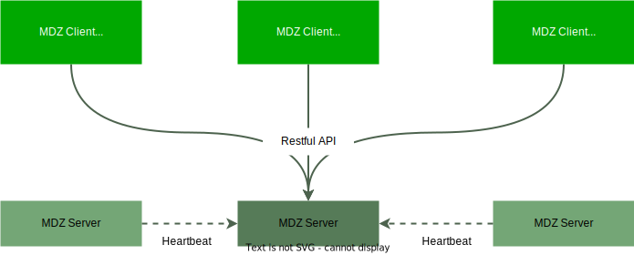
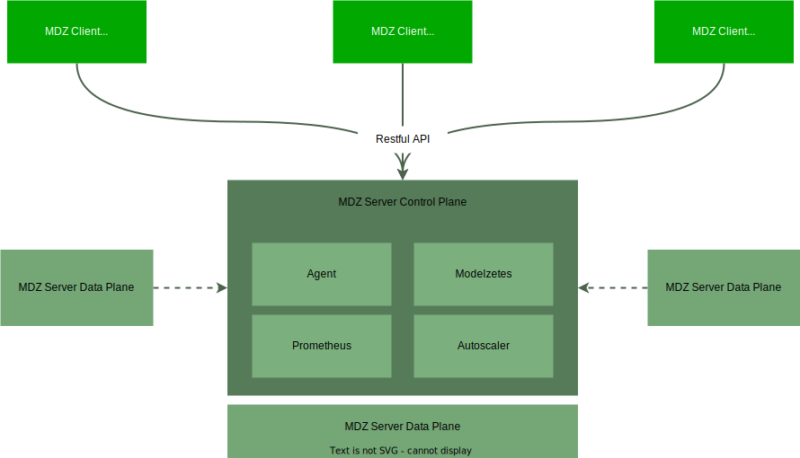

# Architecture

To help both users and developers of OpenModelZ build a mental model of how it works, this page documents the system architecture.

## Overview

The architecture of OpenModelZ looks like this:

We have the client, a.k.a `mdz` CLI, and the server.

## `mdz` CLI

The `mdz` CLI is the client of OpenModelZ. It is a command line tool that helps you manage the lifecycle of the deployments. It is also the only way to interact with the server (We will provide a web UI in the future).

## Server

Servers run the deployments. The first server created by `mdz server start` is also responsible for managing the other servers. The other servers will be the worker nodes, which are only responsible for running the deployments.

## Getting in depth

Here is a more detailed diagram of the architecture. There are several components in the server under the hood.

The agent implements all the APIs used by the `mdz` CLI. It contains the core logic of OpenModelZ. OpenModelZ could support multiple runtimes (e.g. local docker daemon, AWS ECS, Kubernetes, etc.) with the help of different agent implementations. Currently, we only support Kubernetes and the local docker daemon (limited). 

Prometheus is used to collect metrics from the agent. All the requests to the agent, and the deployments will be recorded and exposed as metrics.

Autoscaler is responsible for scaling the deployments. It will periodically pull the metrics from Prometheus and scale the deployments based on the metrics.

Modelzetes is a Kubernetes operator that manages the deployments on Kubernetes runtime.

Besides this, we will also have an ingress operator to provision endpoints for the deployments. It is not shown in the diagram.

### Deployment endpoint

The endpoint of a deployment is the URL that you could use to access the deployment. It is automatically generated for each deployment with the following format: `<name>-<random-string>.<ip>.modelz.live`.

We host a DNS server to resolve the endpoint to the IP address of the server. Then we have a ingress controller (nginx) to route the requests to the corresponding deployment. The DNS server is also not shown in the diagram.
