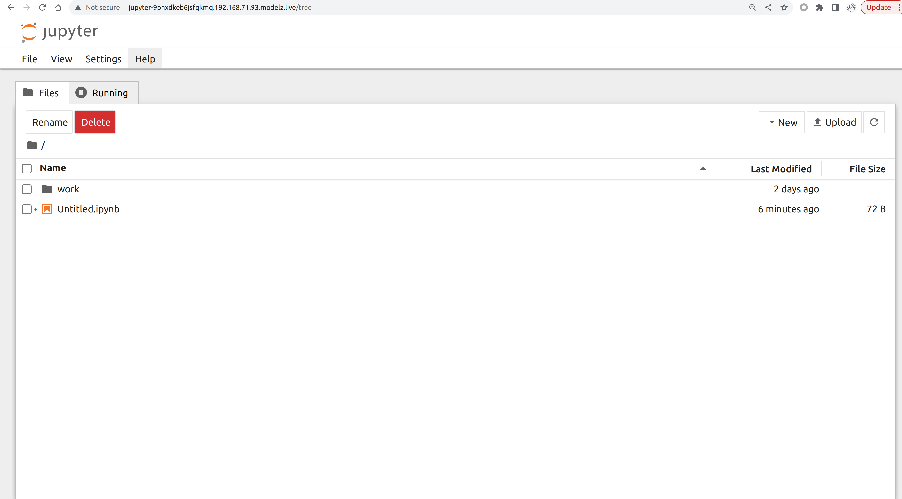

# Create the First Deployment

## Install `mdz`

You can install OpenModelZ using the following command:

```text copy
# Installing and using openmodelz this way is currently only supported on Linux.
pip install openmodelz
```

You could verify the installation by running the following command:

```text copy
mdz
```

Once you've installed the `mdz` you can start deploying models and experimenting with them. There are only one concepts in `mdz`:

- **Deployment**: A deployment is a running inference service. You could configure the number of replicas, the port, and the image, and some other parameters.

## Create your first OpenAI compatible API server

Once you've bootstrapped the `mdz` server, you can start deploying your first applications. We will use jupyter notebook as an example in this tutorial. You could use any docker image as your deployment.

```text
$ mdz deploy --image jupyter/minimal-notebook:lab-4.0.3 --name jupyter --port 8888 --command "jupyter notebook --ip='*' --NotebookApp.token='' --NotebookApp.password=''"
Inference jupyter is created
$ mdz list
 NAME     ENDPOINT                                                   STATUS  INVOCATIONS  REPLICAS
 jupyter  http://jupyter-9pnxdkeb6jsfqkmq.192.168.71.93.modelz.live  Ready           488  1/1
          http://192.168.71.93/inference/jupyter.default                                                                         
```

You could access the deployment by visiting the endpoint URL. The endpoint will be automatically generated for each deployment with the following format: `<name>-<random-string>.<ip>.modelz.live`.

It is `http://jupyter-9pnxdkeb6jsfqkmq.192.168.71.93.modelz.live` in this case. The endpoint could be accessed from the outside world as well if you've provided the public IP address of your server to the `mdz server start` command. 



## Create your first API-based deployment

You could also create API-based deployments. We will use [OpenAI compatible API server with Bloomz 560M](https://github.com/tensorchord/modelz-llm#run-the-self-hosted-api-server) as an example in this tutorial.

```text
$ mdz deploy --image modelzai/llm-bloomz-560m:23.07.4 --name simple-server
Inference simple-server is created
$ mdz list
 NAME           ENDPOINT                                                         STATUS  INVOCATIONS  REPLICAS 
 jupyter        http://jupyter-9pnxdkeb6jsfqkmq.192.168.71.93.modelz.live        Ready           488  1/1      
                http://192.168.71.93/inference/jupyter.default                                                 
 simple-server  http://simple-server-lagn8m9m8648q6kx.192.168.71.93.modelz.live  Ready             0  1/1      
                http://192.168.71.93/inference/simple-server.default                                           
```

You could use OpenAI python package and the endpoint `http://simple-server-lagn8m9m8648q6kx.192.168.71.93.modelz.live` in this case, to interact with the deployment.

```python
import openai
openai.api_base="http://simple-server-lagn8m9m8648q6kx.192.168.71.93.modelz.live"
openai.api_key="any"

# create a chat completion
chat_completion = openai.ChatCompletion.create(model="bloomz", messages=[
    {"role": "user", "content": "Who are you?"},
    {"role": "assistant", "content": "I am a student"},
    {"role": "user", "content": "What do you learn?"},
], max_tokens=100)
```

If your service requires GPUs, you can add the `--gpu 1` flag to indicate how many GPUs you need. The deployment will be scheduled to a GPU node.

```text /--gpu 1/
$ mdz deploy --image aikain/simplehttpserver:0.1 --name simple-server --port 80 --gpu 1
Inference simple-server is created
```

Please checkout the [server](/server/start) page for more information about the `mdz server` command and GPU support.

## Scale your deployment

You could scale your deployment by using the `mdz scale` command.

```text /scale/
$ mdz scale simple-server --replicas 3
```

The requests will be load balanced between the replicas of your deployment. 

You could also tell the `mdz` to **autoscale your deployment** based on the inflight requests. Please check out the [Autoscaling](/deployment/autoscale) section for more details.

## Debug your deployment

Sometimes you may want to debug your deployment. You could use the `mdz logs` command to get the logs of your deployment.

```text /logs/
$ mdz logs simple-server
simple-server-6756dd67ff-4bf4g: 10.42.0.1 - - [27/Jul/2023 02:32:16] "GET / HTTP/1.1" 200 -
simple-server-6756dd67ff-4bf4g: 10.42.0.1 - - [27/Jul/2023 02:32:16] "GET / HTTP/1.1" 200 -
simple-server-6756dd67ff-4bf4g: 10.42.0.1 - - [27/Jul/2023 02:32:17] "GET / HTTP/1.1" 200 -
```

You could also use the `mdz exec` command to execute a command in the container of your deployment. You do not need to ssh into the server to do that.

```text /exec/
$ mdz exec simple-server ps
PID   USER     TIME   COMMAND
    1 root       0:00 /usr/bin/dumb-init /bin/sh -c python3 -m http.server 80
    7 root       0:00 /bin/sh -c python3 -m http.server 80
    8 root       0:00 python3 -m http.server 80
    9 root       0:00 ps
```

```text /exec/
$ mdz exec simple-server -ti bash
bash-4.4# 
```

Or you could port-forward the deployment to your local machine and debug it locally.

```text /port-forward/
$ mdz port-forward simple-server 7860
Forwarding inference simple-server to local port 7860
```
