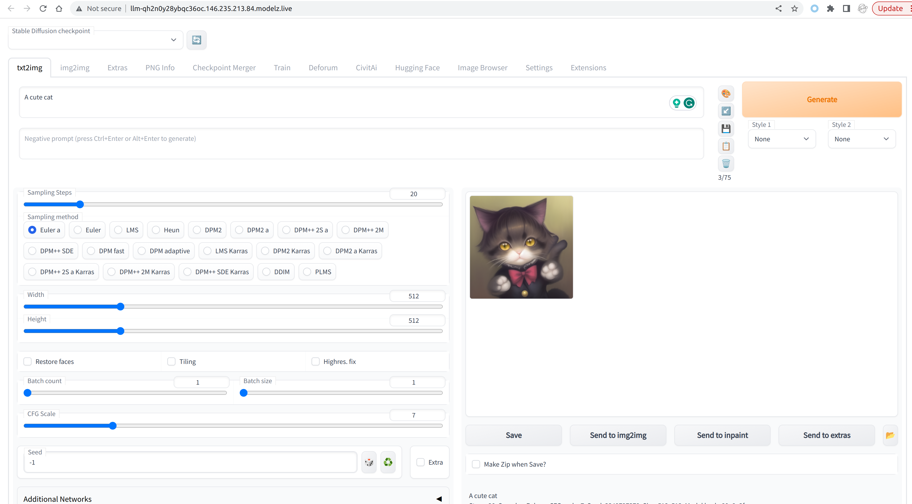

# Stable Diffusion Web UI

## Image Details

- Image name: [`modelzai/gradio-stable-diffusion`](https://hub.docker.com/repository/docker/modelzai/gradio-stable-diffusion)
- Repository: [AUTOMATIC1111/stable-diffusion-webui](https://github.com/AUTOMATIC1111/stable-diffusion-webui)
- Dockerfile: [Dockerfile](https://github.com/camenduru/stable-diffusion-webui-docker/blob/main/Dockerfile.Lite)

## Deployment

### `mdz`

You could deploy the stable diffusion web UI with the following command:

```text
$ mdz deploy --image modelzai/gradio-stable-diffusion:23.03 --name sdw --port 7860 --gpu 1
Inference sd is created
$ mdz list
 NAME  ENDPOINT                                                 STATUS  INVOCATIONS  REPLICAS 
 sdw   http://sdw-qh2n0y28ybqc36oc.146.235.213.84.modelz.live   Ready           174  1/1      
       http://146.235.213.84.modelz.live/inference/sdw.default                                
```

You could access the stable diffusion web UI by visiting the endpoint URL. The endpoint will be automatically generated for each deployment with the following format: `<name>-<random-string>.<ip>.modelz.live`.

It is `http://sdw-qh2n0y28ybqc36oc.146.235.213.84.modelz.live` in this case. The endpoint could be accessed from the outside world as well if you've provided the public IP address of your server to the `mdz server start` command.


